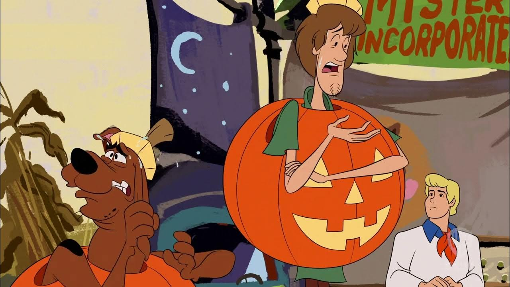
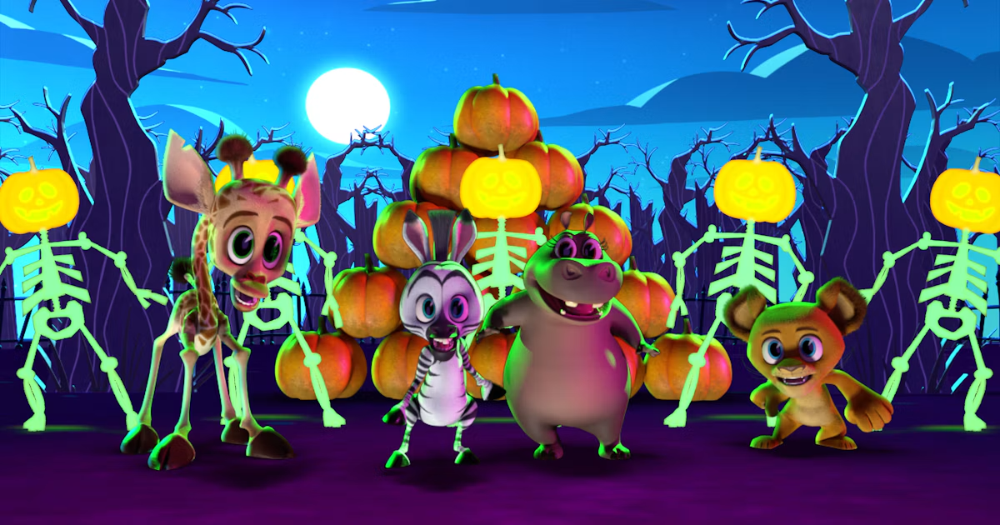

---
layout: single
title: "31 Days of Halloween Movies 🎃👻"
categories: [movies]
tags: []
---     

*It's spooky season!*    

## The Goal
My goal is to watch at least one Halloween themed movie every day this month. The movie may be a horror movie, animated movie, or anything in-between! Ideally I will watch at least one film per day that I haven't seen before. I also plan to write a short blurb about the movie that I have watched and post it here on this blog!   

## The Template    
**🎥 Movie:**     
**🗓️ Release Year:**            
**🍿 MPA Rating:**          
**⌚ Duration:**  Minutes    
**📺 Where I Watched:**   
                    
**📝 IMDB Description:** [See Full IMDB Page]()       
              
**🎬 Letterboxd Review:**       
             
**📼 Letterboxd Rating:** /5               
**🥤 IMDB Rating:** /10      
**✨ My Rating:**  ⭐  

       

**🎞️Total Duration Watched:**  Minutes     

----    

So without further ado, let's get to it!    

   

🚨**Spoilers ahead**🚨     

----       

## Day 1: October 1st      
**🎥 Movie:** Friday the 13th    
**🗓️ Release Year:** 1980              
**🍿 MPA Rating:** R            
**⌚ Duration:** 95 Minutes    
**📺 Where I Watched:** Peacock   
                    
**📝 IMDB Description:** A group of teenage camp counselors attempt to re-open an abandoned summer camp with a tragic past, but they are stalked by a mysterious, relentless killer. [See Full IMDB Page](https://www.imdb.com/title/tt0080761/)     
          
**🎬 Letterboxd Review:** I thought the theme song was pretty good. I wish we had learned a little bit more about Jason, but I guess that’s what the other films are for. The characters were pretty typical slasher movie characters. I did like the reveal of the killer being Pamela Voorhees aka Jason's mom. The final fight scenes between Alice Pamela Voorhees was so annoying. It was ridiculous. I did like the portrayl of Pam where she plays both Jason and herself. "Mommy kill her." "I will Jason. I will." Then when Alice manages to decapitate Pam in one swipe while the entire time she could barely hit here. Unbelievable. I did gasp when Jason popped up out of the water in the dream sequence of Alice. Overall it was an alright film. I can’t say that I’ll watch it again.      
          
**📼 Letterboxd Rating:** 3.0/5               
**🥤 IMDB Rating:** 6.4/10          
**✨ My Rating:** 2 ⭐    

            
                
**🎞️Total Duration Watched:** 95 Minutes  

## Day 2: October 2nd
**🎥 Movie:** Corpse Bride      
**🗓️ Release Year:** 2005                
**🍿 MPA Rating:** PG            
**⌚ Duration:** 77 Minutes    
**📺 Where I Watched:** HBO Max         
                    
**📝 IMDB Description:** When a shy groom practices his wedding vows in the inadvertent presence of a deceased young woman, she rises from the grave assuming he has married her. [See Full IMDB Page](https://www.imdb.com/title/tt0121164/?ref_=nv_sr_srsg_1_tt_5_nm_3_in_0_q_corpse%20)        
              
**🎬 Letterboxd Review:**  I liked this. I didn’t realize it was kind of a musical. It had some funny lines. It was a good Johnny Depp and Helena Bonham Carter film. The story was good, but I think I personally just don't necessarily care for the animation style. I respect it, but it just isn't my favorite.     

“I’ve got a dwarf.”                

“Mystery woman? He doesn’t even know any women!”       

“Don’t be ridiculous. What corpse would marry our Victor?”     

“There’s an eye in me soup.”            

“You don’t know me, but I used to live in your dead mother.”          

“Alfred? You’ve been dead for 15 years.” “Frankly my dear I don’t give a damn.”        
             
**📼 Letterboxd Rating:** 3.9/5               
**🥤 IMDB Rating:** 7.4/10       
**✨ My Rating:** 3 ⭐  

        

**🎞️Total Duration Watched:** 172 Minutes    

## Day 3: October 3rd   
I was on a trip, and I did not get a chance to watch a film this day. 🙈 I did watch a portion of the film Suspira (1977) through the window while waiting for brunch, but I think for this I want to have watched the film in its entirety.     

        

## Day 4: October 4th   
Once again, I was on a trip, and I did not get a chance to watch a film this day. 🙈 I will make up for it sometime this month.    

      

## Day 5: October 5th
**🎥 Movie:** Trick or Treat Scooby-Doo!    
**🗓️ Release Year:** 2022              
**🍿 MPA Rating:** G              
**⌚ Duration:** 72 Minutes       
**📺 Where I Watched:** HBO Max      
                    
**📝 IMDB Description:** With Coco and kitty in prison, Mystery Inc. thinks that they can finally enjoy a break. [See Full IMDB Page](https://www.imdb.com/title/tt21919270/?ref_=nv_sr_srsg_3_tt_7_nm_0_in_0_q_trick%20or%20treat)       
              
**🎬 Letterboxd Review:** This Scooby Doo movie was just alright. I did like Coco Diablo. I also loved that it was Matthew Lillard as Scooby; however, the voice for Velma threw me off so much. I thought the plot was a standard Scooby Doo movie, but idk there was just something about it I didn’t particularly care for. I did like the nostalgia of the original criminals. We saw the miner, the robot, the ghost of Captain Cutler, and some others. We see Velma trying to flirt with Coco, and it went as you expected. I thought the catching of the perpetrator was a little dull. I did like the scene where it shows Scooby and Shaggy sleeping in each other's beds which I thought was quite believable. I also liked Shaggy and Scooby dressed up as each other in their dream sequence. Overall, this was mid, and I don’t think I’d watch it again. It did have some funny lines though.            
             
**📼 Letterboxd Rating:** 3.3/5               
**🥤 IMDB Rating:** 5.8/10      
**✨ My Rating:** 2.5 ⭐  

()       

**🎞️Total Duration Watched:** 244 Minutes    

## Day 6: October 6th  
### 1st Movie 
**🎥 Movie:** Hotel Transylvania 4: Transformania      
**🗓️ Release Year:** 2022              
**🍿 MPA Rating:** PG            
**⌚ Duration:** 87 Minutes    
**📺 Where I Watched:** Prime Video    
                    
**📝 IMDB Description:** After one experiment, Johnny turns into a monster and everyone else becomes human. Now it has to be seen whether they will be able to reverse this experiment. [See Full IMDB Page](https://www.imdb.com/title/tt9848626/?ref_=nv_sr_srsg_6_tt_8_nm_0_in_0_q_hotel%20tran)       
              
**🎬 Letterboxd Review:** A fun continuation of the franchise. It picks up not too long after the 3rd film where they go on a cruise. Almost every other voice was the same person with the exception of Dracula, but I think Brian Hull did a phenomenal job. I almost didn’t know it was a different actor.     

I thought the story was cute. We didn’t really see much of Dennis. It was focused mainly on Drac and Jonny, and I liked seeing more of their relationship. The story was a little predictable, but I thought it was fun. It was silly seeing the other main characters transform into humans. I’d probably watch this again.            
             
**📼 Letterboxd Rating:** 2.3/5               
**🥤 IMDB Rating:** 6.0/10      
**✨ My Rating:** 3 ⭐ (Genuinely I had a hard time deciding between 3 and 3.5)    

           

**🎞️Total Duration Watched:** 331 Minutes       

### 2nd Movie
**🎥 Movie:** Madagascar: A Little Wild - A Fang-tastic Halloween          
**🗓️ Release Year:** 2020           
**🍿 MPA Rating:** G              
**⌚ Duration:** 24 Minutes    
**📺 Where I Watched:** Hulu     
                    
**📝 IMDB Description:** After hearing spooky rumors about the new habitat resident- A BAT- Marty is determined to protect his friends from the newcomer. But when the bat helps him out of a tough situation, Marty learns it's better to get to know someone before judging them. [See Full IMDB Page](https://www.imdb.com/title/tt13385016/?ref_=fn_t_1)       
              
**🎬 Letterboxd Review:** This was a cute short film about learning not to judge others too soon. It had some songs which were a little silly, but it was geared towards kids. I did think the pumpkin carving was cute. I also liked the monkeys used sign language which is what some in the zoos have been taught. This makes me want to have a glowing top hat or crown like they were able to quickly make.    

"That's okay, I scare easily."           
             
**📼 Letterboxd Rating:** 3.0/5               
**🥤 IMDB Rating:** 6.2/10      
**✨ My Rating:** 3 ⭐  

       

**🎞️Total Duration Watched:** 355 Minutes  

----   
Thanks for reading, and I'd love to hear your thoughts and suggestions for films to watch this month!       

Happy watching! 🍿   

Until tomorrow,     
        
             

XOXO 💗 Joe    